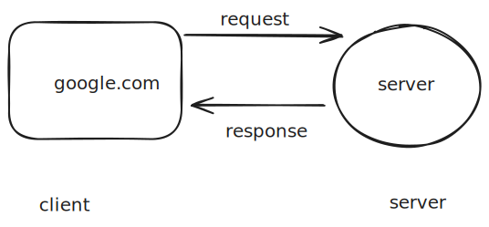
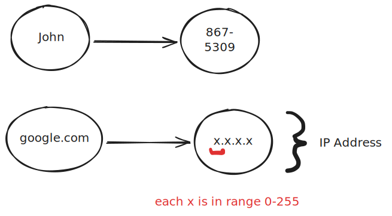
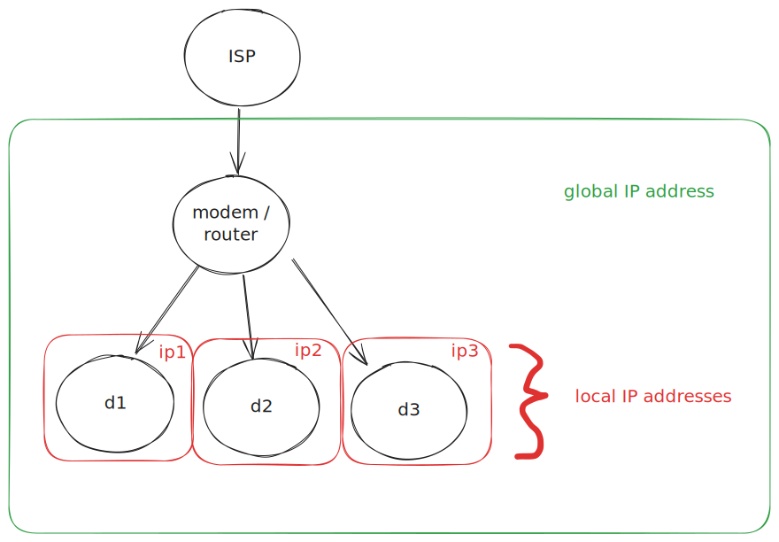
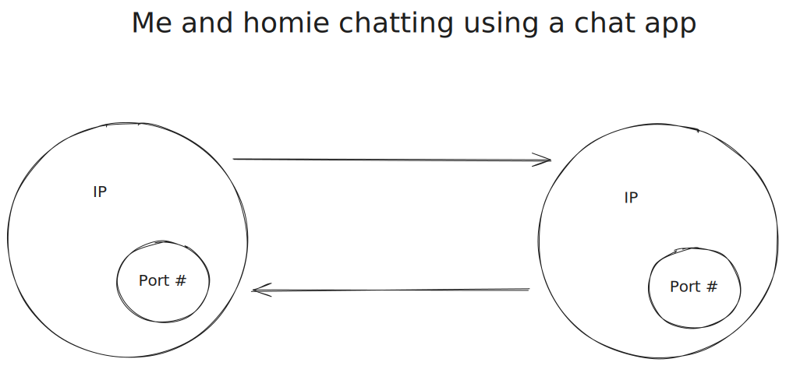

# Networking

## History

Arpanet was the first network to implement the TCP/IP protocol suite.


> We've got these research projects
> that are funded by the government
> and we want them to be able to share
> information with each other.

## High Level

Example request:



* __TCP (Transmission Control Protocol)__: ensures that data will reach destination and won't be corrupted
* __UDP (User Datagram Protocol)__: video conferencing as an example, where you don't care if some data is lost
* __HTTP (Hyptertext transfer protocol)__: used for web pages

* __Packets__: small chunks of data that are sent over the network



```bash
# get public IP address of my machine
curl ifconfig.me -s
```

DHCP (Dynamic Host Configuration Protocol) is used to assign IP addresses to devices on a network (will be discussed later!)



A request to google from my machine will be seen as coming from my global IP address.

> Which device gets the data back?

When the request comes back, the modem will determine which device to send it to using Network Device Translation (NAT).

> Which application gets the data?

We use ports to determine which application gets the data.



Ports are 16-bit numbers, so there are $2^16 = 65536$ possible ports.

* HTTP uses port 80
* 0-1023 are reserved ports
* 1024-49151 are registered ports for applications
* 49152-65535 are dynamic ports (we can use for whatever)
