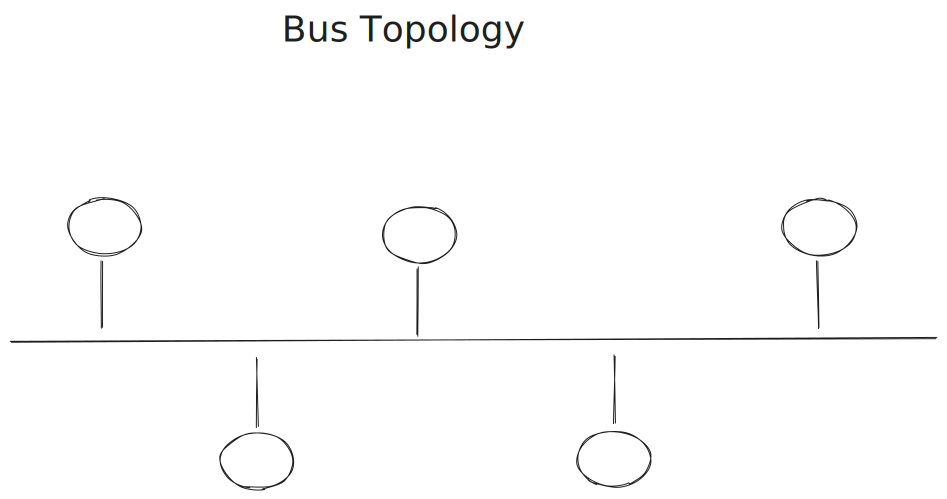
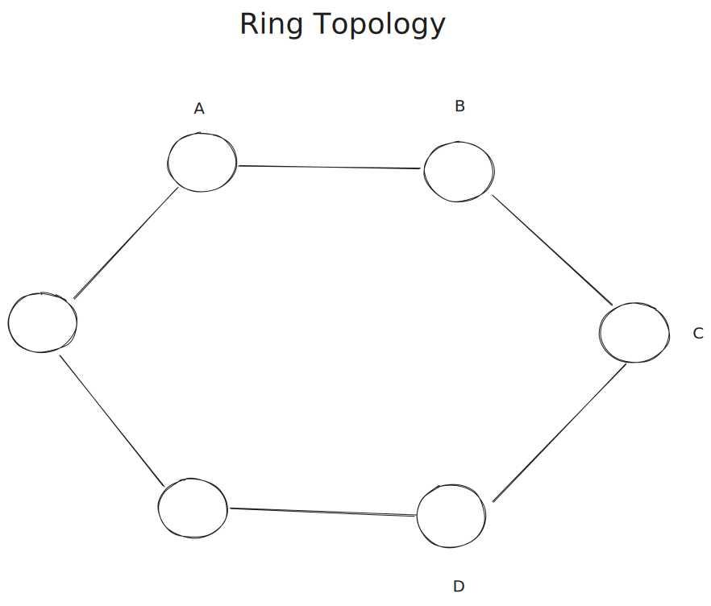
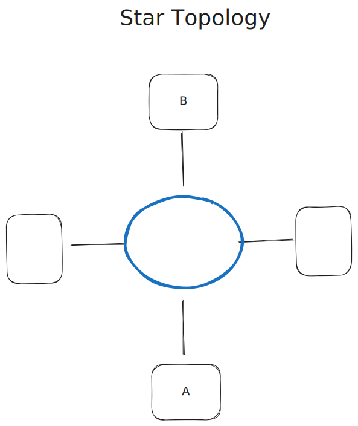
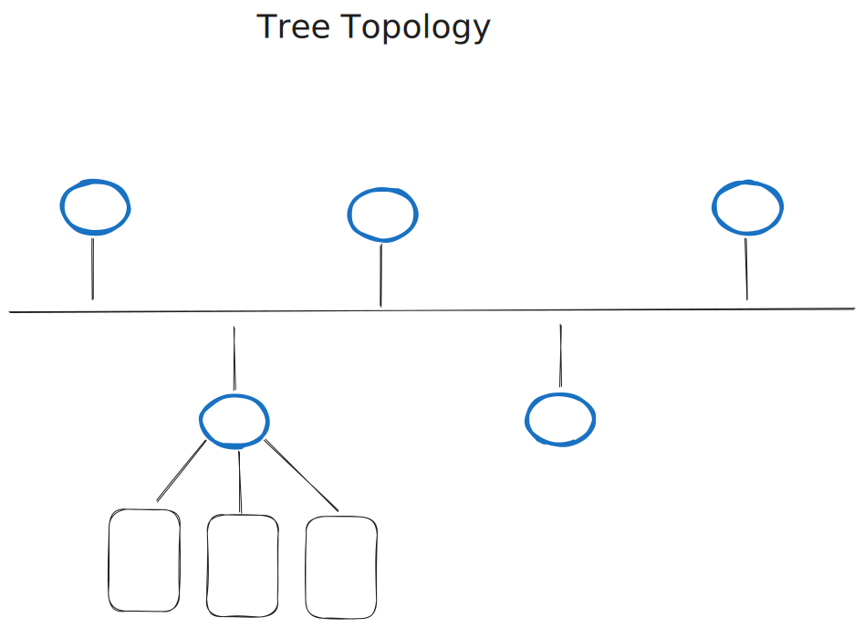
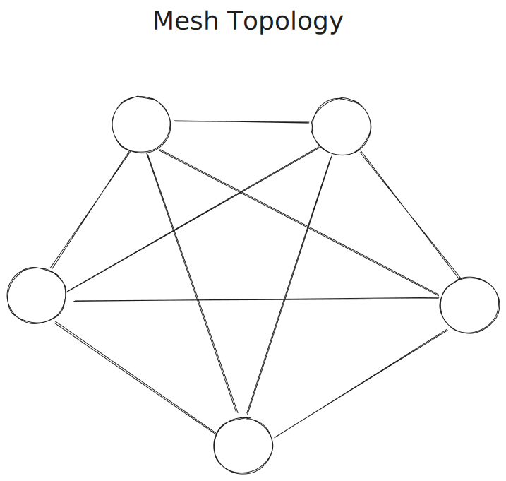

# Networking

## History

Arpanet was the first network to implement the TCP/IP protocol suite.


> We've got these research projects
> that are funded by the government
> and we want them to be able to share
> information with each other.

## High Level

Example request:


* __TCP (Transmission Control Protocol)__: ensures that data will reach destination and won't be corrupted
* __UDP (User Datagram Protocol)__: video conferencing as an example, where you don't care if some data is lost
* __HTTP (Hyptertext transfer protocol)__: used for web pages

* __Packets__: small chunks of data that are sent over the network


```bash
# get public IP address of my machine
curl ifconfig.me -s
```

DHCP (Dynamic Host Configuration Protocol) is used to assign IP addresses to devices on a network (will be discussed later!)


A request to google from my machine will be seen as coming from my global IP address.

> Which device gets the data back?

When the request comes back, the modem will determine which device to send it to using Network Device Translation (NAT).

> Which application gets the data?

We use ports to determine which application gets the data.


Ports are 16-bit numbers, so there are $2^{16} = 65536$ possible ports.

* HTTP uses port 80
* 0-1023 are reserved ports
* 1024-49151 are registered ports for applications
* 49152-65535 are dynamic ports (we can use for whatever)

### Speed

1 gps = 1 billion bits per second
1 mbps = 1 million bits per second
1 kbps = 1 thousand bits per second

### [Submarine Cable Map](https://www.submarinecablemap.com/)

Fiber optic cables are used to connect continents.


Google owns a lot of these underground cables.

### How countries are connected

Physical connections:

* Optical fiber cables
* Coaxial cables

Wireless:

* Bluetooth
* Wi-Fi
* 3G, 4G LTE, 5G

### LAN, MAN, WAN

* __LAN (Local Area Network)__
  * small house / office
  * ethernet
  * wifi
* __MAN (Metropolitan Area Network)__
  * across a city
* __WAN (Wide Area Network)__
  * across countries
  * optical fiber cables

Internet is a colletion of LAN, MAN, and WAN.

A lot of LAN connected to each other using MAN that are connected to each other using WAN.

__SoNET__(synchronous optical network): SoNET carries data using fiber optical cables and can cover wide distances
__Frame relay__: way to connect LANs to a wider area

### Modems and Routers

* __Modem__: used to convert digital data to analog data and vice versa
* __Router__: device that routes data based on IP addresses

Modem can convert data into an electrical signal that can be sent over a phone line.
The receiving modem will convert the electrical signal back into data.

### Topologies

__BUS__: all devices are connected to a single cable



If the cable breaks, the network is down.

Only one device can send data at a time.

__RING__: devices are connected in a ring



All devices are connected to each other.

To send data from device `A` to device `D`, the data will go through `B` and `C` as well.

If one of the cables breaks, the network is down.

There are a lot of uneccessary connections.

__STAR__: all devices are connected to a central device



If device `A` wants to send data to device `B`, it will send data to the central device, which will then send the data to device `B`.

If the central device breaks, the network is down.

__TREE__: a combination of star and bus topologies



Each section in the bus is a star topology.

This is more fault tolerant than the bus topology.

__MESH__: every device is connected to every other device



* Expensive.
* Scalability issues.
